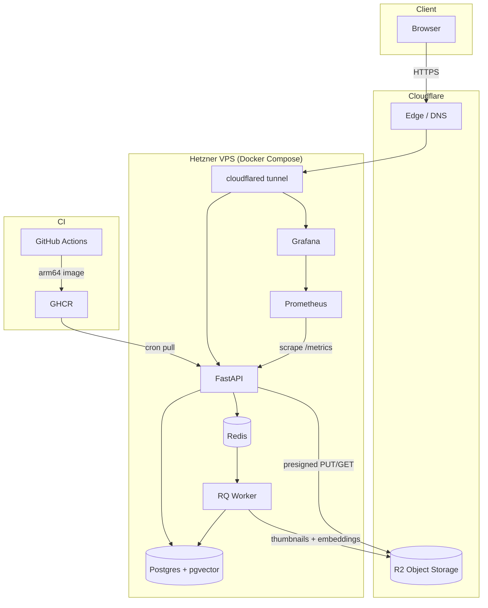

# Photo Delivery Platform

Per-client photo galleries with secure delivery, async processing, and face-similarity search — self-hosted on a single VPS.

## Architecture



## Stack

| Layer | Choice |
|---|---|
| API | FastAPI + Uvicorn |
| Queue | RQ on Redis |
| Database | Postgres 16 + pgvector |
| Object storage | Cloudflare R2 |
| Face pipeline | InsightFace (ArcFace) + HDBSCAN |
| Observability | Prometheus + Grafana |
| Frontend | React + TypeScript + Tailwind |
| Infra | Hetzner VPS + Cloudflare Tunnel |
| CI/CD | GitHub Actions → GHCR → cron pull |

## How it works

- **Upload:** admin registers a photo → API returns a presigned R2 PUT URL → client uploads directly to R2 → API callback enqueues an ingest job → worker thumbnails, detects faces, computes embeddings, marks photo `ready`
- **Delivery:** client authenticates with a per-gallery passcode → API issues short-lived presigned GET URLs → browser fetches directly from R2
- **Face search:** client consents → worker embeds detected faces via InsightFace → pgvector HNSW nearest-neighbour search scoped to that gallery → HDBSCAN clusters faces into identities for the people filter UI

## Running locally

```bash
cp .env.example .env
docker compose up --build
```

| Service | URL |
|---|---|
| API + frontend | http://localhost:8000/app/ |
| API docs | http://localhost:8000/docs |
| Grafana | http://localhost:3000 |
| Prometheus | http://localhost:9090 |

Frontend dev server (with HMR):
```bash
cd frontend && npm install && npm run dev
# opens http://localhost:5173
```

## Tests

```bash
pip install -r requirements.txt
pytest -q
```

Covers: access-control isolation, idempotent ingest, job failure/dead-letter, face pipeline consent gating, search scoping, GDPR erasure and DeletionLog.

## Deploying

Requires a Linux VPS with Docker, a Cloudflare account, and a Cloudflare R2 bucket.

```bash
git clone https://github.com/oguzhan-uy/photo-platform /opt/photo
cd /opt/photo && cp .env.example .env
# fill in ADMIN_TOKEN, SECRET_KEY, R2_*, CLOUDFLARE_TUNNEL_TOKEN, APP_IMAGE
docker compose --profile prod up -d
```

Updates pull automatically via a cron job:
```bash
*/10 * * * * cd /opt/photo && docker compose pull --quiet && docker compose --profile prod up -d --quiet-pull
```
