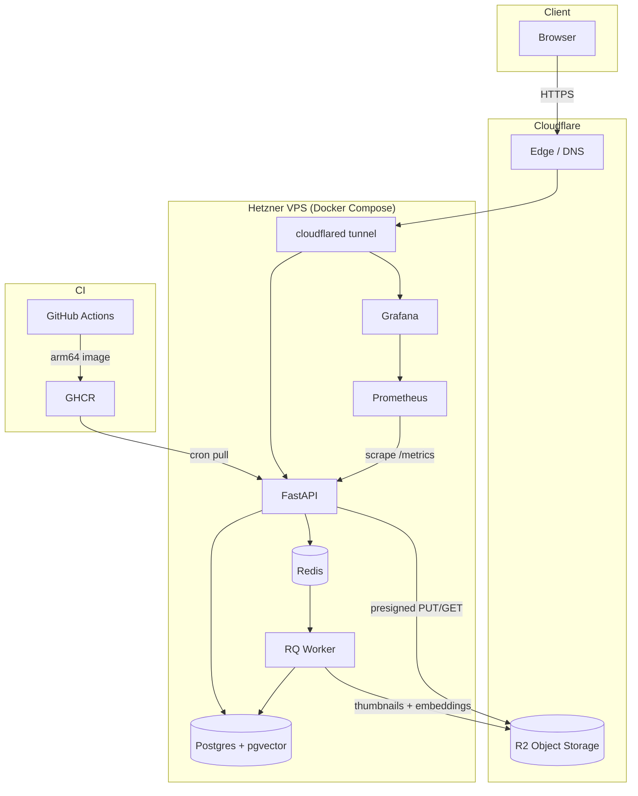

# Photo Delivery Platform

A self-hosted platform for event and sports photographers to deliver photos securely to clients — with per-gallery passcode access, direct-to-cloud storage, and optional face-search so clients can find themselves in a crowd.

## The Problem It Solves

A photographer shoots 800 photos at a youth football tournament. Ten different families need their photos — and only their photos. Email is too slow, Google Drive is a mess, and third-party galleries take a cut or lock you in.

This platform gives the photographer a private admin panel to upload once and share a password-protected link with each family. Each client logs in, sees only their gallery, and downloads presigned links directly from Cloudflare R2 — the server never touches the photo bytes.

## Features

**For the photographer (admin)**
- Create clients and password-protected galleries
- Register photos — get a presigned upload URL back, upload directly to R2
- Set gallery expiry dates; a nightly job deletes expired galleries and logs the erasure
- Hard-delete a client (GDPR): removes all DB rows, R2 objects, and writes a verifiable `DeletionLog`
- Prometheus metrics + Grafana dashboards out of the box

**For the client**
- Authenticate with a per-gallery passcode → receive a short-lived scoped token
- Browse only their own gallery; cross-gallery access returns 404, not 403
- Download photos via presigned R2 GET URLs (no bandwidth through the server)
- Opt into face search: find photos of yourself using face-similarity search (ArcFace embeddings + pgvector HNSW), browse by detected identity clusters

**Platform**
- Async ingest pipeline: thumbnailing, face detection, embedding — all in a background worker
- Idempotent jobs with bounded retries and explicit failure state (no silent failures)
- Biometric consent gate: face pipeline only runs if the client has opted in; revocation purges all embeddings
- Structured JSON logging with correlation IDs on every request
- Self-hosted on Hetzner VPS + Cloudflare R2 + Cloudflare Tunnel (zero open inbound ports)

## Architecture



## Stack

| Layer | Choice |
|---|---|
| API | FastAPI + Uvicorn |
| Queue | RQ on Redis |
| Database | Postgres 16 + pgvector |
| Object storage | Cloudflare R2 |
| Face pipeline | InsightFace (ArcFace) + HDBSCAN |
| Observability | Prometheus + Grafana |
| Frontend | React + TypeScript + Tailwind |
| Infra | Hetzner VPS + Cloudflare Tunnel |
| CI/CD | GitHub Actions → GHCR → cron pull |

## How it works

- **Upload:** admin registers a photo → API returns a presigned R2 PUT URL → client uploads directly to R2 → API callback enqueues an ingest job → worker thumbnails, detects faces, computes embeddings, marks photo `ready`
- **Delivery:** client authenticates with a per-gallery passcode → API issues short-lived presigned GET URLs → browser fetches directly from R2
- **Face search:** client consents → worker embeds detected faces via InsightFace → pgvector HNSW nearest-neighbour search scoped to that gallery → HDBSCAN clusters faces into identities for the people filter UI

## Prerequisites

- [Docker Desktop](https://www.docker.com/products/docker-desktop/) (includes Compose)
- Node.js 18+ (only if running the frontend dev server)

## Running locally

The default config uses MinIO (bundled in Docker Compose) as a local stand-in for Cloudflare R2 — no cloud credentials needed.

```bash
# Linux / macOS
cp .env.example .env

# Windows (Command Prompt)
copy .env.example .env

# Windows (PowerShell)
Copy-Item .env.example .env
```

```bash
docker compose up --build
```

| Service | URL |
|---|---|
| API + frontend | http://localhost:8000/app/ |
| API docs (Swagger) | http://localhost:8000/docs |
| Grafana | http://localhost:3000 |
| Prometheus | http://localhost:9090 |

**Admin token:** the default `.env` sets `ADMIN_TOKEN=dev-admin-token-change-me`. Use this value as a `Bearer` token in the `Authorization` header when calling any `/admin/*` endpoint via the Swagger UI or curl.

Frontend dev server (with HMR):
```bash
cd frontend && npm install && npm run dev
# opens http://localhost:5173
```

## Tests

```bash
docker compose run api pytest -q
```

Covers: access-control isolation, idempotent ingest, job failure/dead-letter, face pipeline consent gating, search scoping, GDPR erasure and DeletionLog.

## Deploying

Requires a Linux VPS with Docker, a Cloudflare account, and a Cloudflare R2 bucket.

```bash
git clone https://github.com/oguzhan-uy/photo-platform /opt/photo
cd /opt/photo && cp .env.example .env   # then fill in the values below
# fill in ADMIN_TOKEN, SECRET_KEY, R2_*, CLOUDFLARE_TUNNEL_TOKEN, APP_IMAGE
docker compose --profile prod up -d
```

Updates pull automatically via a cron job:
```bash
*/10 * * * * cd /opt/photo && docker compose pull --quiet && docker compose --profile prod up -d --quiet-pull
```
